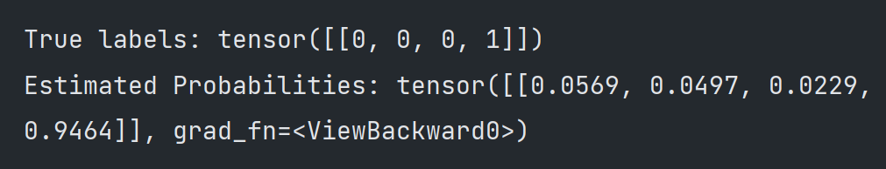

In this model, I trained a model that will find the words in a sentence corresponding to a `LOCATION`, which will be always of span 1(meaning that `San Fransisco` won't be recognized as a `LOCATION`). 

Instead of letting the model to only take a look at one word in each forward pass, I would like it to be able to consider the context of the word. That is, for each word, I want my model to be aware of the surrounding words.

"The complete code for the model is included in `word_window_model.py`."

"For the training and test processes, I conducted them in the `wordwindow.ipynb` notebook."

The final test results:

</img>

